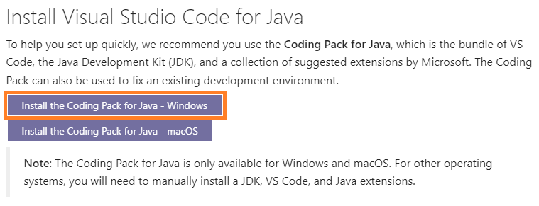

# Running Java on a DRHS School Computer
We may not be able to write code for our robots on school computers yet, but we can use school computers to learn how to write and manage basic Java code.

## Prerequisites
* A DRHS account to login to the computer
* [Visual Studio Code (VSCode)](https://code.visualstudio.com/) already installed on the computer

## Installation Instructions
Go to https://code.visualstudio.com/docs/languages/java and click "Install the Coding Pack for Java - Windows. This should install the JDK (Java Development Kit) and VSCode Java extensions that make it easier to run Java in VSCode.

## Creating a Java Project
1. Press `ctrl` + `shift` + `P` to open the VSCode Command Palette.
2. Choose `"Java: Create Java Project..."`
3. Choose `No build tools`
4. Create/choose a folder on the `C:` drive of the computer
    1. Choose "This PC"
    2. Choose "Windows (C:)"
    3. Create a folder for your project
    4. Select that folder with "Select Project Location"
5. Name the project the same name as the folder created in Step 4.

## Debugging The Java Program
1. Open the `src/App.java` file.
2. Press `F5` to debug the program.

We can put breakpoints in our code for debugging by following [these instructions](https://code.visualstudio.com/docs/languages/java#_debugging).

## TBD: Creating and Running a Java Project with Gradle
Our robot code uses Gradle with Groovy to manage our Java Project but the easy-peazy option to use Gradle with the `Java: Create Java Project...` does not seem to work with the permissions we have on school computers. WE WILL FIND A WAY!